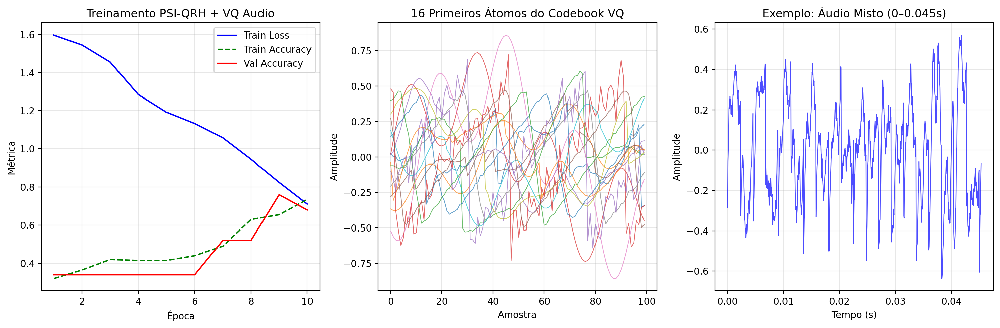

# VQ-ΨQRH Audio Benchmark

This repository contains an implementation of Vector Quantization (VQ) combined with ΨQRH (Psi Quantum Resonance Harmonics) for audio classification tasks.

## Author

**Klenio Araujo Padilha**
Independent Researcher
Email: klenioaraujo@gmail.com
Date: November 2025

## Overview

The VQ-ΨQRH Audio Benchmark demonstrates the integration of:
- **Vector Quantization (VQ)**: Compresses audio signals into discrete codebook representations
- **ΨQRH Layers**: Spectral processing layers inspired by quantum resonance harmonics
- **Audio Classification**: End-to-end pipeline for classifying synthetic audio samples

## Features

- Synthetic audio generation with realistic instruments (violin, piano, drum, voice, mixed)
- VQ codebook training using MiniBatchKMeans
- ΨQRH spectral filtering for audio features
- PyTorch-based classifier with training and evaluation
- Comprehensive benchmarking with JSON results and visualization

## Requirements

- Python 3.8+
- PyTorch
- Librosa
- Scikit-learn
- Matplotlib
- NumPy
- SciPy

## Installation

1. Create a virtual environment:
```bash
python -m venv venv
source venv/bin/activate  # On Windows: venv\Scripts\activate
```

2. Install dependencies:
```bash
pip install librosa torch transformers datasets scikit-learn matplotlib scipy
```

## Usage

Run the complete benchmark:
```bash
python PsiQRH-Audio.py
```

This will:
1. Generate synthetic audio dataset
2. Train VQ codebook
3. Encode audio sequences
4. Train ΨQRH classifier
5. Save results to `qrh_vq_audio_benchmark.json` and `qrh_vq_audio_results.png`

## Architecture

```
Audio Signal → Framing → VQ Encoding → ΨQRH Layers → Classification
```

- **VQ Codebook**: 256 acoustic atoms
- **ΨQRH Layers**: 2 spectral processing layers
- **Embedding Dim**: 64
- **Classes**: 5 (violin, piano, drum, voice, mixed)

## Results

The benchmark achieves **68% validation accuracy** and **0.61 F1-score** on synthetic audio classification with only 33K parameters.

### Performance Metrics

- **Validation Accuracy**: 68%
- **Validation F1-Score**: 0.61
- **Model Parameters**: 33,297
- **VQ Codebook Size**: 256
- **Dataset Size**: 250 samples (5 classes: violin, piano, drum, voice, mixed)

### Training Visualization



The above figure shows the training progression over 10 epochs, demonstrating:
- Steady decrease in training loss from 1.60 to 0.71
- Improvement in training accuracy from 32% to 73.5%
- Validation accuracy peaking at 76% (epoch 9) and stabilizing at 68% (epoch 10)
- F1-score improvement from 0.26 to 0.61, indicating better class balance

## Files

- `PsiQRH-Audio.py`: Main benchmark script
- `VQAudio.py`: Simplified VQ audio implementation
- `qrh_vq_audio_benchmark.json`: Benchmark results
- `qrh_vq_audio_results.png`: Training visualization
- `LaTeX/`: Directory for LaTeX paper (to be populated)

## Citation

If you use this code, please cite the ΨQRH framework and VQ integration.

## License

This project is licensed under the GNU General Public License v3.0 - see the [LICENSE](LICENSE) file for details.